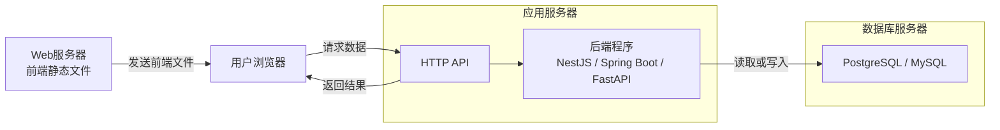

* content
  {:toc}

## 前言

刚开始接触 Web 开发时，JavaScript、TypeScript、React、Vue、Next.js、Node.js、Spring Boot 这些名称很容易混在一起。

原因并不复杂：它们本来就不属于同一层。有些是编程语言，有些是运行环境，有些负责页面，还有一些专门处理服务器和数据库。

这篇文章按照一条实际请求的运行过程，把这些概念重新整理一遍。


## 一、前后端分别负责什么

用户在浏览器中看见并操作的部分叫前端，例如：

- 页面布局
- 输入框和按钮
- 表格与图表
- 表单校验
- 页面跳转
- 数据展示

后端运行在服务器中，负责处理前端看不见的工作，例如：

- 接收请求
- 执行业务规则
- 查询和修改数据库
- 用户登录与权限验证
- 文件上传
- 调用其他系统接口

前端与后端通常通过 HTTP API 通信。

```text
用户操作页面
    ↓
前端发送 HTTP 请求
    ↓
后端处理业务
    ↓
后端读写数据库
    ↓
返回处理结果
    ↓
前端更新页面
```

## 二、语言、运行环境和框架的区别

理解前后端架构前，需要先分清三个概念。

### 编程语言

编程语言用来写代码。

常见语言包括：

| 语言       | 常见用途                            |
| ---------- | ----------------------------------- |
| JavaScript | 浏览器前端、Node.js 后端            |
| TypeScript | React、Vue、Next.js 和 Node.js 后端 |
| Java       | Spring Boot 后端                    |
| Python     | FastAPI、Django、数据处理和 AI      |
| C#         | ASP.NET Core 后端                   |

TypeScript 可以看作带类型检查的 JavaScript。它通常先转换成 JavaScript，再交给浏览器或 Node.js 执行。

```text
TypeScript
    ↓ 编译
JavaScript
    ↓
浏览器或 Node.js
```

### 运行环境

运行环境负责执行代码。

| 运行环境       | 执行内容                |
| -------------- | ----------------------- |
| 浏览器         | 前端 JavaScript         |
| Node.js        | 浏览器之外的 JavaScript |
| JVM            | Java 程序               |
| Python Runtime | Python 程序             |

Node.js 不是前端框架，也不是后端框架。它是 JavaScript 的运行环境。

### 框架和库

框架为开发提供已经组织好的结构和功能。

| 名称        | 类型             | 作用                          |
| ----------- | ---------------- | ----------------------------- |
| React       | 前端 UI 库       | 构建页面组件                  |
| Vue 3       | 前端框架         | 构建页面、表单和交互          |
| Next.js     | React 应用框架   | 为 React 增加路由和服务端能力 |
| NestJS      | Node.js 后端框架 | 开发结构化的 TypeScript 后端  |
| Spring Boot | Java 后端框架    | 开发企业级后端                |
| FastAPI     | Python 后端框架  | 开发 API 和数据服务           |

## 三、React、Vue 3 和 Next.js

React 和 Vue 3 都用于前端开发，通常选择其中一个。

```text
前端路线 A：TypeScript + React
前端路线 B：TypeScript + Vue 3
```

它们负责的事情比较接近：

- 拆分页面组件
- 管理页面数据
- 处理用户操作
- 展示后端返回的结果

Next.js 建立在 React 之上。

```text
Next.js = React + 路由 + 服务端渲染 + 服务端接口
```

所以 React 和 Vue 是两条不同的前端路线，而 Next.js 属于 React 生态。

```text
React
  └── Next.js

Vue 3
  └── Nuxt
```

普通后台管理页面、内部工具可以直接使用 React 或 Vue。需要服务端渲染、搜索引擎收录或者全栈能力时，再考虑 Next.js 或 Nuxt。

## 四、Node.js 到底负责什么

Node.js 有两个常见角色。

### 开发前端时

现代前端项目通常需要 Node.js 运行开发工具：

```text
React / Vue / Next.js 源代码
            ↓
Node.js 运行 npm、Vite、TypeScript 编译器
            ↓
生成 HTML、CSS、JavaScript
            ↓
浏览器运行
```

这个阶段的 Node.js 运行在开发电脑上。用户打开网页后，真正显示页面的是浏览器。

### 开发后端时

Node.js 也可以运行后端程序。

```text
TypeScript
    ↓
NestJS 或 Express
    ↓
Node.js 执行
    ↓
提供 HTTP API
```

常见组合是：

```text
TypeScript + Node.js + NestJS + PostgreSQL
```

其中 TypeScript 是语言，NestJS 是后端框架，Node.js 是运行环境，PostgreSQL 是数据库。

## 五、Spring Boot 和 FastAPI

Spring Boot 和 FastAPI 都是后端框架，但使用的语言不同。

| 对比项   | Spring Boot               | FastAPI                |
| -------- | ------------------------- | ---------------------- |
| 使用语言 | Java                      | Python                 |
| 运行环境 | JVM                       | Python Runtime         |
| 常见场景 | 物流、金融、ERP、企业系统 | API、数据处理、AI 服务 |
| 项目结构 | 完整、规范                | 简洁、灵活             |
| 学习成本 | 相对较高                  | 相对较低               |

前端不需要关心后端使用哪种语言。只要 HTTP API 的地址、参数和返回格式保持一致，React 或 Vue 都可以与它们配合。

```text
Vue 3
  ↓ HTTP API
Spring Boot
  ↓
PostgreSQL
```

也可以是：

```text
React
  ↓ HTTP API
FastAPI
  ↓
PostgreSQL
```

Node.js 后端、Spring Boot 和 FastAPI 通常是三条可选路线，不需要在一个普通项目中全部使用。

## 六、HTTP API 是什么

HTTP API 是前端访问后端的通信入口。

假设前端要查询订单 `BL001`，可能发送下面的请求：

```http
GET /api/orders/BL001
```

后端收到请求后查询数据库，再返回 JSON：

```json
{
  "billNo": "BL001",
  "origin": "Shanghai",
  "destination": "Hamburg",
  "status": "In Transit"
}
```

前端拿到数据后，将它显示在页面上。

常见的请求方法有：

| 方法      | 常见用途 |
| --------- | -------- |
| GET       | 查询数据 |
| POST      | 新增数据 |
| PUT/PATCH | 修改数据 |
| DELETE    | 删除数据 |

HTTP API 并不是脱离后端单独运行的一套程序。它通常由 NestJS、Spring Boot 或 FastAPI 直接实现。

## 七、服务器放在哪里

服务器是程序实际运行的计算机或云资源，不是一种编程框架。

一个完整的 Web 系统通常有三种逻辑角色：

```text
Web 服务器
应用服务器
数据库服务器
```

### Web 服务器

Web 服务器负责发布前端文件：

```text
HTML
CSS
JavaScript
图片
字体
```

常见选择包括 Nginx、对象存储和 CDN。

用户访问网址时，浏览器先从 Web 服务器下载前端文件。

### 应用服务器

应用服务器负责运行后端程序：

```text
Node.js + NestJS
或 Java + Spring Boot
或 Python + FastAPI
```

HTTP API 也运行在这里。

### 数据库服务器

数据库服务器运行 PostgreSQL、MySQL 等数据库，用来长期保存数据。

完整请求过程如下：



## 八、前端是否需要放到服务器

如果用户通过浏览器访问网页，前端文件需要发布到 Web 服务器、对象存储或 CDN。

```text
用户浏览器
    ↓ 下载网页
Web服务器 / CDN
    ↓ 调用 API
应用服务器
    ↓
数据库
```

如果前端通过 Capacitor 打包成 Android 或 iOS App，HTML、CSS 和 JavaScript 可以直接放在安装包里。

```text
Android / iOS App
└── HTML + CSS + JavaScript
```

此时前端本身不一定需要 Web 服务器，但涉及多人共享数据时，App 仍然要访问后端服务器。

## 九、一台云服务器能否部署所有内容

可以。

小型项目经常把前端、后端和数据库部署在同一台云服务器中：

```text
一台云服务器
├── Nginx
│   └── 发布 React/Vue 前端
├── NestJS/Spring Boot/FastAPI
│   └── 提供 HTTP API
└── PostgreSQL/MySQL
    └── 保存数据
```

这种部署方式成本低，也方便维护。缺点是服务器一旦发生故障，前端、后端和数据库会同时不可用。

项目规模扩大后，可以逐步拆开：

```text
CDN / Web服务器
        ↓
应用服务器
        ↓
独立云数据库
```

所以“Web 服务器”“应用服务器”和“数据库服务器”首先是逻辑角色，并不一定对应三台真实机器。

## 十、Next.js 的服务器位置

Next.js 需要根据使用方式判断。

如果只生成静态页面：

```text
Next.js
    ↓ 构建
HTML + CSS + JavaScript
    ↓
Web服务器 / CDN
```

如果使用服务端渲染、Server Actions 或 API：

```text
用户浏览器
    ↓
Node.js
    ↓
Next.js 服务端
    ↓
数据库或其他后端服务
```

此时 Next.js 的服务端部分需要部署在应用服务器上。

## 十一、常见技术组合

### React 全栈

```text
TypeScript + React + Next.js + Node.js + PostgreSQL
```

适合需要服务端渲染或全栈能力的网站。

### Vue 前端与 Node.js 后端

```text
TypeScript + Vue 3 + NestJS + Node.js + PostgreSQL
```

前后端都使用 TypeScript，语言比较统一。

### Vue 或 React 与 Java 后端

```text
Vue 3 / React + Spring Boot + PostgreSQL
```

常见于物流、金融和企业内部系统。

### Vue 或 React 与 Python 后端

```text
Vue 3 / React + FastAPI + PostgreSQL
```

适合数据处理、自动化和 AI 相关系统。

## 十二、总结

把整套关系压缩后，可以得到下面这条主线：

```text
编程语言
    ↓
前端或后端框架
    ↓
对应的运行环境
    ↓
部署到服务器
    ↓
通过 HTTP API 通信
    ↓
数据库保存数据
```

浏览器负责运行前端页面。Node.js、JVM 或 Python Runtime 负责运行服务器代码。NestJS、Spring Boot 和 FastAPI 负责处理业务，PostgreSQL 或 MySQL 保存数据。

技术名称很多，但实际项目仍然沿着同一条路径运行：

```text
用户操作页面
→ 前端发送请求
→ 后端处理业务
→ 数据库读写数据
→ 后端返回结果
→ 前端更新页面
```
